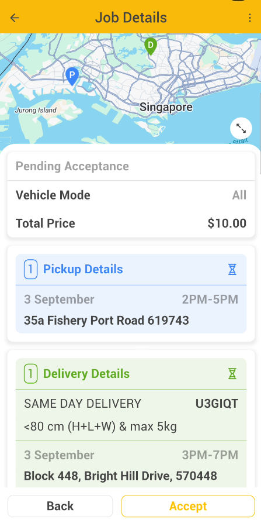

# Agent Dry Run Testing

This page documents the process of dry run testing the app from a delivery agent perspective. It covers the complete workflow of receiving, accepting, and completing delivery requests posted by customers. This complements the [Customer Dry Run Testing](3-dry-runs/a-customer.md) workflow.

## Prerequisites

- Agent must be logged in and have an active profile
- Customer has posted a delivery request (as shown in [Customer Dry Run Testing](3-dry-runs/a-customer.md))
- Agent location services must be enabled
- Agent must be within service area

## Steps

### 1. **Agent Dashboard - View Available Requests (Jobs)**

   - Agents can see and accept all posted delivery requests in Singapore
   - Requests show pickup location, destination, earnings, date and time of delivery

### 2. **Review Delivery Request Details**

   - View complete request information posted by customer
   - Check pickup and delivery addresses with map view
   - Review parcel details and special instructions (remarks)
   - See date & time of delivery and earnings

### 3. **Accept Delivery Request**

   - Agent clicks "Accept" to claim the delivery
   - Request is removed from other agents' available list
   - Customer receives notification of agent assignment
   - Agent can view and manage the delivery request in their "My Jobs" tab
   - When agent pickup the parcel, deliver it to the recipient, the agent need to update the status of the delivery request.

### 4. **Update Delivery Status**

   - Agent can update the status of the delivery request at various stages (e.g., "Picked Up", "Delivered") by scanning the QR code on the parcel or enter the code manually.

### 5. **Cancel Delivery Request**

   - Agent can cancel the delivery request before picking up the parcel and enter the reason for cancellation.
   - Customer receives notification of cancellation.

### 6. **Complete Delivery**

   - After completing the delivery, the agent must update the status to "Delivered" and optionally take a photo proof of delivery.

### 7. **Job History**

   - Agent able to check the job history for completed deliveries.
   - Agent also able to mark favorite jobs for receiving notifications when similar jobs are posted.

### 8. **Agent Wallet**

   - View earnings summary and transaction history in the wallet section.
   - The page also shows agents the commission rate (20% platform commission) and nett earnings.
   - Agent can only instant payout earnings after reaching nett earnings of $200, otherwise payout will be processed according to the platform's payout schedule.

## Connection to Customer Workflow

This agent workflow directly connects to the [Customer Dry Run Testing](3-dry-runs/a-customer.md) process at multiple touchpoints:

#### **Request Creation & Visibility**
- **Customer Step 6** ("Check the Posted Delivery Request") → **Agent Step 1** ("Agent Dashboard"): Customer's posted request appears in agent's available jobs list
- Customer completes payment (Step 5) and request becomes visible to all agents in Singapore

#### **Request Acceptance & Notifications**
- **Agent Step 3** ("Accept Delivery Request") → **Customer receives notification**: When agent accepts, customer gets immediate notification of agent assignment
- Request is removed from other agents' dashboards, ensuring single assignment

#### **Status Updates & Tracking**
- **Agent Step 4** ("Update Delivery Status") → **Customer tracking updates**: Each status change (Picked Up, In Transit, Delivered) sends real-time notifications to customer
- Customer can track delivery progress through their app interface

#### **Delivery Completion**
- **Agent Step 6** ("Complete Delivery") → **Customer completion notification**: Final delivery confirmation with optional photo proof sent to customer
- Both customer and agent receive completion confirmation

#### **Cancellation Scenarios**
- **Customer Step 7** ("Cancel before Acceptance") → **Agent dashboard update**: Cancelled requests immediately disappear from agent job listings
- **Agent Step 5** ("Cancel Delivery Request") → **Customer notification**: Customer receives cancellation notice with reason

---
 

> **Testing Note**: These workflows should be tested simultaneously to validate the complete delivery ecosystem functionality and real-time communication between customer and agent interfaces.