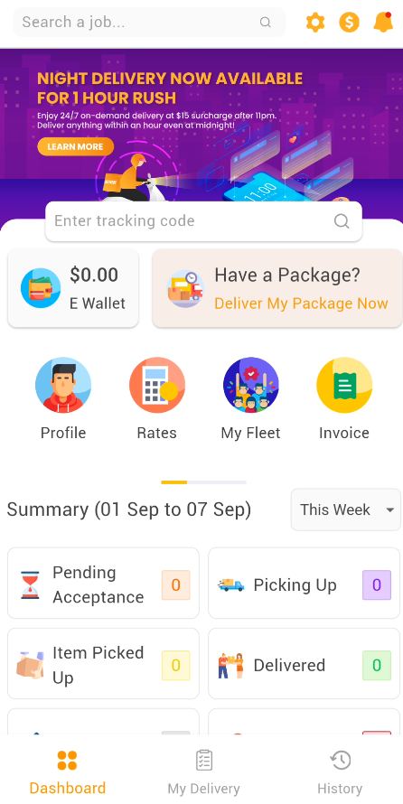
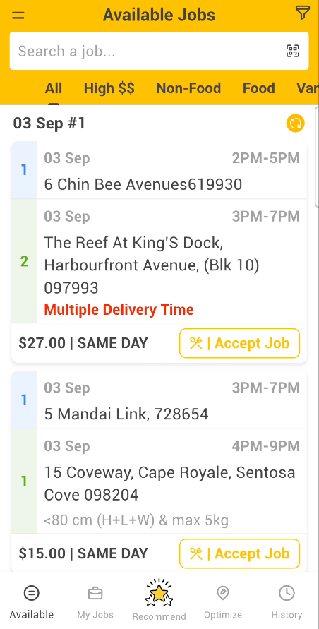

# Problems Faced During The Dry-Run

The following problems were identified during the dry-run sessions. These issues could be <u>***personal preferences or experiences***</u> and don't represent the views of all users.

### Customer Dry-Run

- **"When first time using the I was not sure where to start. The homepage is overwhelming with buttons leads to different functionalities."**
- **The lack of guidance or onboarding process** made it difficult to understand the workflow.
- **The request for delivery button is not that obvious** and easily overlooked. (Have a Package? Deliver My Package Now)
- **The main functionalities are all packed in one page** which make the homepage overcrowded.
- **The Rates leads to a webview** which is not a best practice for displaying such information in mobile app.
- **The styling and layout of the app is very basic** and not attractive when compare to other apps in the market.

### Agent Dry-Run

- **In the homepage, the color of the text for date is in light gray**, making it hard to read against the white background and agent might miss important information when overlooking the package details.
- **Some jobs are automatically bundled together** according to the region and agent are unable to break the bundle when accepting the jobs. For example agent have to accept all jobs in the bundle even if they want to deliver only one package. Although the agent can cancel the bundle after delivering the one package he/she wants and they still will be paid accordingly, **this adds extra steps and complexity** to the process.
- **The earning stated in the jobs are not nett earnings**, agent might not be aware of the deductions that will be made, leading to confusion and dissatisfaction.
- **Too much functionalities are packed into the navigation sidebar**, making it a long list and hard to navigate to the desired feature that agents usually use.
- **When the app is on, the notification for new jobs is sometimes annoying and disruptive.** Agent have to turn off the notification to avoid distractions when they are not working as a delivery agent. Besides, **the battery consumption might be affected** due to constant background activity.
- **The styling and layout of the app is very basic** and not attractive when compare to other apps in the market.